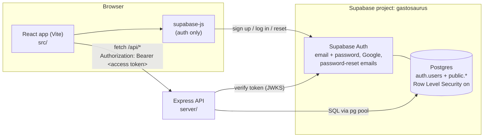
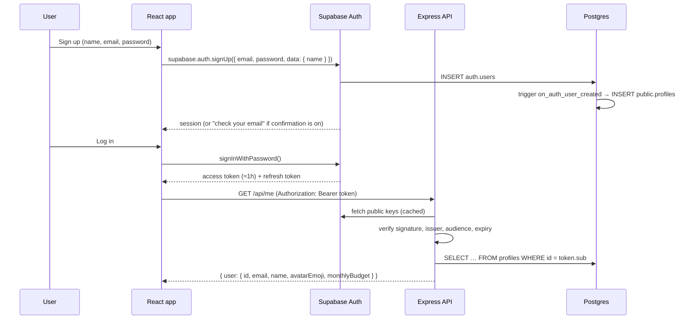
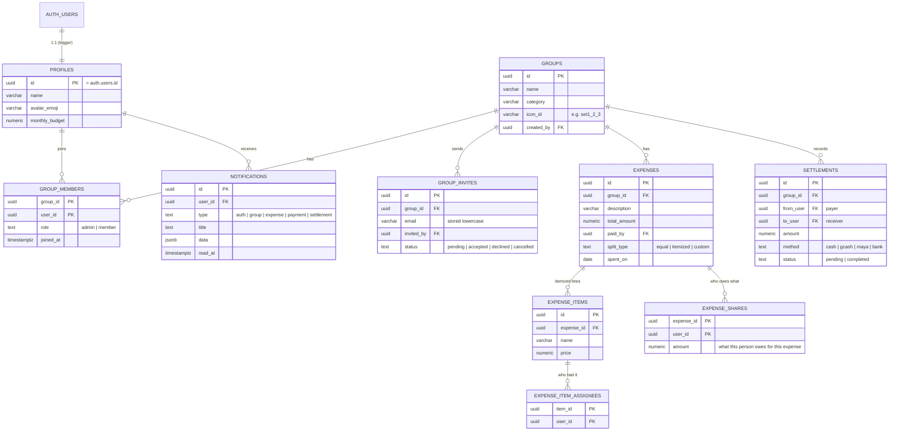

# Gastosaurus — System Architecture

Gastosaurus tracks group expenses and auto-splits them "ambagan"-style, including itemized splits where people pay only for what they ordered. This document describes how the backend is built and the plan for the remaining phases.

**Status:** Phase 1 (accounts: sign up, log in, Google, password reset, profile) is built. Phases 2–5 are designed below and not built yet.

---

## 1. The big picture



There are three parts:

| Part | What it does | Where |
|---|---|---|
| **React app** | All screens. Uses `supabase-js` *only* for login, sign-up, Google, password reset, and keeping the session fresh. Every other request goes to our API. | `src/` |
| **Supabase Auth** | Stores accounts and passwords, signs access tokens, sends confirmation and reset emails, and handles Google OAuth. We never handle passwords ourselves. | Supabase dashboard → Authentication |
| **Express API** | All app logic: groups, expenses, splitting math, balances, settlements, notifications. It checks the user's token, then reads and writes Postgres with plain SQL (`pg`). | `server/` |
| **Postgres (Supabase)** | One database. `auth.users` is owned by Supabase. Our tables live in `public` and are created by migrations in `supabase/migrations/`. | Supabase dashboard → Database |

**Why this split?** Supabase Auth gives us secure login, Google sign-in and reset emails for free. Writing those well is hard and easy to get wrong. The money logic (who owes whom) stays in a normal Express + SQL backend, where it's easy to test, explain and grade.

---

## 2. Tech stack

| Layer | Choice | Notes |
|---|---|---|
| Frontend | React 19 + Vite | Existing app. Dev server on `:5173`, proxies `/api` → `:4000`. |
| Auth | Supabase Auth via `@supabase/supabase-js` | PKCE flow. The session lives in localStorage ("Keep me logged in") or sessionStorage (not kept). |
| API | Node.js 20+ · Express 5 · ES modules | Express 5 forwards errors from async handlers automatically. |
| Validation | `zod` | Every request body is validated before it reaches the service layer. |
| Token check | `jose` | Verifies Supabase access tokens against the project's public keys (JWKS). |
| Database | Supabase Postgres 17 via `pg` | Parameterized SQL only (`$1, $2…`), and never string-built values. |
| Tests | `node --test` | The API is tested against a local throwaway Postgres and a fake Supabase Auth server. |
| Hosting (suggested) | Vercel (frontend) · Render (API) · Supabase (DB + auth) | All have free tiers. See §9. |

---

## 3. Folder structure

```
gastosaurus/
├── src/                       React app
│   ├── lib/
│   │   ├── supabase.js        Supabase client + "Keep me logged in" storage + friendly errors
│   │   └── api.js             fetch wrapper for /api (adds the Bearer token)
│   └── components/AuthModal.jsx   Log in / Sign up / Forgot / New password / Check email
├── server/                    Express API
│   ├── src/
│   │   ├── server.js          starts the app (checks DB first)
│   │   ├── app.js             middleware + route mounting
│   │   ├── config/env.js      all environment variables in one place
│   │   ├── db/pool.js         pg Pool, query(), withTransaction()
│   │   ├── lib/verifySupabaseToken.js
│   │   ├── middleware/        requireAuth, validateBody, errorHandler
│   │   ├── utils/HttpError.js
│   │   └── modules/
│   │       └── profile/       profile.routes.js, profile.repository.js
│   │       (next: groups/, expenses/, settlements/, notifications/)
│   └── test/
├── supabase/migrations/       SQL migrations, applied in filename order
└── docs/ARCHITECTURE.md       this file
```

### Layers inside each API module

```
routes  →  validation (zod)  →  service (rules, math)  →  repository (SQL only)
```

- **routes**: URL + method, `requireAuth`, `validateBody(schema)`, call the service, send JSON.
- **service**: business rules ("only members can add expenses", "shares must add up to the total"). No `req`/`res` here.
- **repository**: the only place SQL lives. It returns plain rows.

Small modules (like `profile`) can put the service logic in the route file. Split it out once it grows.

### Error format (every endpoint)

```json
{ "error": { "code": "VALIDATION_ERROR", "message": "Please check the highlighted fields.", "fields": { "name": "Enter your name or nickname." } } }
```

Codes in use: `VALIDATION_ERROR` (400), `UNAUTHORIZED` (401), `FORBIDDEN` (403), `NOT_FOUND` (404), `CONFLICT` (409), `INTERNAL_ERROR` (500). Throw `HttpError.badRequest(...)` and similar from anywhere, and the error handler formats the response.

---

## 4. How login works (Phase 1)



- **Who is the user?** The API trusts only the verified token. `req.user.id` comes from the token's `sub` and equals `auth.users.id` and `profiles.id`. Never accept a user id from the request body.
- **Keep me logged in.** Checked: the session goes in localStorage and survives restarts. Unchecked: it goes in sessionStorage and ends when the tab closes. `supabase-js` refreshes the token automatically.
- **Google.** `signInWithOAuth({ provider: 'google' })` sends the user to Google and back. The same trigger creates their profile, using Google's `full_name`.
- **Forgot password.** `resetPasswordForEmail()` sends a link. When the user returns, Supabase fires `PASSWORD_RECOVERY`, and the app opens the "Set a new password" screen.
- **Token formats.** New Supabase keys are asymmetric (ES256) and verified locally with JWKS. Legacy HS256 tokens are checked by calling `GET /auth/v1/user`, as Supabase recommends. `verifySupabaseToken.js` handles both.

### Phase 1 endpoints

| Method | Path | Auth | Body | Returns |
|---|---|---|---|---|
| GET | `/api/health` | – | – | `{ status: "ok" }` |
| GET | `/api/me` | ✔ | – | `{ user }` (creates the profile if it's missing) |
| PATCH | `/api/me` | ✔ | `{ name?, avatarEmoji?, monthlyBudget? }` | `{ user }` |

Sign up, log in, log out, Google and reset are **not** API endpoints. They're `supabase.auth.*` calls in the browser.

---

## 5. Data model

Phase 1 tables exist. The others are the plan for Phases 2–5.



### Money rules

- Store money as `numeric(12,2)`, never `float`. `pg` returns `numeric` as a **string**, so convert it on purpose.
- **`expense_shares` is the source of truth.** Whatever the split type, saving an expense also saves one share per person, and the shares must add up to `total_amount` exactly. The service checks this inside a transaction (`withTransaction`).
- **Equal split** of ₱100 among 3 people gives 33.34 + 33.33 + 33.33. Work in centavos (integers), then give the leftover centavos to the first people in the list.
- **Itemized split** (the screen in `ItemizedAmbaganView`): each item's price is divided among its assignees, and each person's share is the sum of their portions. Extra charges such as service charge or delivery can be added as items assigned to everyone.

### Balances (no stored balance column)

A member's net balance in a group is computed live:

```
net = Σ expenses they paid
    − Σ their expense_shares
    + Σ completed settlements they paid out
    − Σ completed settlements they received
```

`net > 0` means "you are owed" and `net < 0` means "you owe". These map to the dashboard's `statusType` values `owed`, `owe` and `settled`. This becomes a SQL view, `group_balances (group_id, user_id, net)`.

**Suggested settlements** ("Settle Up") use a greedy match. Sort debtors and creditors by amount, and repeatedly pay the largest debt toward the largest credit. That needs at most *n − 1* payments.

### Security in the database

- **RLS is on for every table.** The browser gets the *publishable* key, which anyone can read, so the database itself must refuse access to other people's rows. Policies follow the pattern "you can see a group's rows only if you're in `group_members` for it".
- The Express API connects with the database password (server-side only), which bypasses RLS. **So the service layer must also check membership** before every read or write. Example: `assertMember(groupId, req.user.id)`.
- Functions use `security definer` only when necessary (the sign-up trigger), always with `set search_path = ''`.

---

## 6. API plan (all phases)

All endpoints require `Authorization: Bearer <token>`. The `:groupId` routes also require that the caller is a member of that group.

| Phase | Method & path | Purpose | Screen |
|---|---|---|---|
| 1 ✅ | `GET/PATCH /api/me` | Profile | Dashboard header |
| 2 | `GET /api/groups` | My groups with my balance in each | Dashboard, GroupsView |
| 2 | `POST /api/groups` | Create a group (creator becomes admin) | CreateGroupModal |
| 2 | `GET /api/groups/:groupId` | Group + members + pending invites | GroupMembersView |
| 2 | `PATCH /api/groups/:groupId` | Rename, change icon (admin) | GroupDetailModal |
| 2 | `DELETE /api/groups/:groupId/members/me` | Leave a group | LeaveGroupModal |
| 2 | `POST /api/groups/:groupId/invites` | Invite by email | InviteMemberView |
| 2 | `POST /api/invites/:id/accept` · `/decline` · `DELETE /api/invites/:id` | Respond to or cancel an invite | Notifications, InviteMemberView |
| 3 | `GET /api/groups/:groupId/expenses` | Expense list | ExpensesDetailView |
| 3 | `POST /api/groups/:groupId/expenses` | Add an equal, itemized or custom expense (computes shares) | AddExpenseCalculatorView, ItemizedAmbaganView |
| 3 | `GET/PATCH/DELETE /api/expenses/:id` | Expense detail and edit | ExpensesDetailView |
| 4 | `GET /api/groups/:groupId/balances` | Net balance per member + suggested settlements | SettlementsView |
| 4 | `GET /api/me/summary` | Net balance, you owe, you are owed, monthly spending | Dashboard cards |
| 4 | `POST /api/groups/:groupId/settlements` | Record a payment (cash, GCash, Maya…) | PaymentView, SettleUpModal |
| 4 | `PATCH /api/settlements/:id` | Mark completed | SettlementsView |
| 5 | `GET /api/notifications` · `PATCH /api/notifications/:id/read` · `POST /api/notifications/read-all` | Bell and NotificationsView | Navbar, NotificationsView |
| 5 | `POST /api/groups/:groupId/reminders` | Nudge members who owe | SettlementsView |

As each phase lands, replace that screen's `mockData.js` usage with calls in `src/lib/api.js`.

---

## 7. Roadmap

| Phase | Scope | Status |
|---|---|---|
| **1. Accounts** | Supabase Auth, `profiles` + trigger + RLS, `/api/me`, login/sign-up/Google/forgot/new-password UI, logout, protected screens | ✅ Done (branch `backend-auth`) |
| **2. Groups** | `groups`, `group_members`, `group_invites`; create, list, join, leave, invite | Next |
| **3. Expenses** | `expenses`, `expense_items`, `expense_item_assignees`, `expense_shares`; equal and itemized splitting with tests for the rounding rules | |
| **4. Balances & settlements** | `group_balances` view, dashboard summary, suggested settlements, record payments | |
| **5. Notifications** | `notifications` table written by the services (invite sent, expense added, payment received); later, live updates with Supabase Realtime | |
| **6. Deploy** | Vercel + Render + Supabase production settings | |

---

## 8. Running it locally

1. **Frontend env:** `cp .env.example .env.local`. The Supabase URL and publishable key are already filled in.
2. **Backend env:** `cd server && cp .env.example .env`, then paste the database connection string (see `server/README.md`).
3. Install dependencies in both folders: `npm install` at the repo root and `npm install` in `server/`.
4. Run the API and the frontend in two terminals: `cd server && npm run dev` (API on :4000) and `npm run dev` at the root (app on :5173).

### Supabase dashboard settings (one-time, project owner)

| Where | Setting | Why |
|---|---|---|
| Authentication → URL Configuration | **Site URL** = `http://localhost:5173`. Add `http://localhost:5173/**` to Redirect URLs (later, your Vercel URL too). | Confirmation, reset and Google links come back to the app. |
| Authentication → Providers → Email | For class demos, turn **Confirm email** off, *or* set up custom SMTP (Authentication → Emails). | Supabase's built-in email only delivers to your own team's addresses and is heavily rate-limited, so groupmates won't get confirmation emails without SMTP. |
| Authentication → Providers → Google | Enable it and paste the Client ID and Secret from Google Cloud Console (OAuth client, type "Web"). Authorized redirect URI: `https://oieupqfsmnbcoatoicef.supabase.co/auth/v1/callback`. | Makes "Continue with Google" work. Until then it shows a friendly "not switched on yet" message. |

---

## 9. Deployment (when ready)

- **Frontend → Vercel.** Set `VITE_SUPABASE_URL` and `VITE_SUPABASE_PUBLISHABLE_KEY`. To keep `/api` same-origin, add a `vercel.json` rewrite from `/api/(.*)` to `https://<your-render-app>.onrender.com/api/$1`. Otherwise set `VITE_API_URL` and the server's `CLIENT_ORIGIN`.
- **API → Render** (Web Service, root `server/`, start command `npm start`). Set `NODE_ENV=production`, `DATABASE_URL` (pooler string), `SUPABASE_URL`, `SUPABASE_PUBLISHABLE_KEY` and `CLIENT_ORIGIN`.
- **Supabase.** Add the production URL to Auth → URL Configuration. Run `get advisors` in the dashboard (Advisors) after every migration.

## 10. Conventions

- **Migrations.** `supabase/migrations/YYYYMMDDHHMMSS_short_name.sql`. Never edit one that's already applied; add a new file. Every new table gets `enable row level security` plus policies in the same file.
- **SQL.** Use `$1` parameters, `snake_case` columns in the DB and `camelCase` in JSON. Repositories convert between them.
- **Secrets.** The publishable key can be public. The database password, `.env` files and any `sb_secret_…` key must never be committed. `.gitignore` covers `.env*` and `server/.env`.
- **Branches.** Use one branch per phase (`backend-auth`, `backend-groups`, …) and merge to `main` with a pull request.
