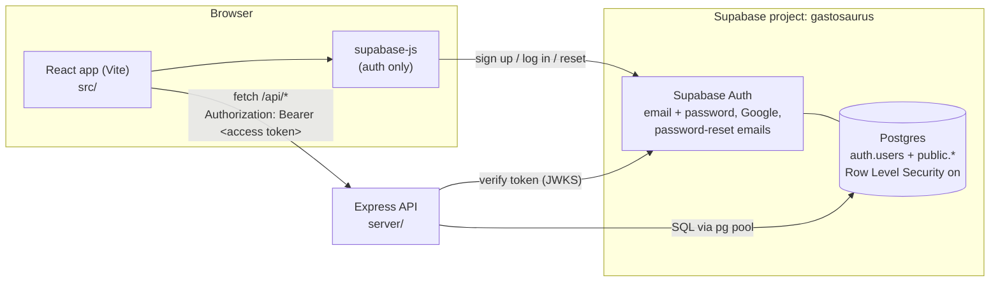
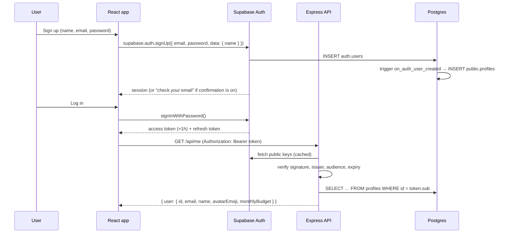
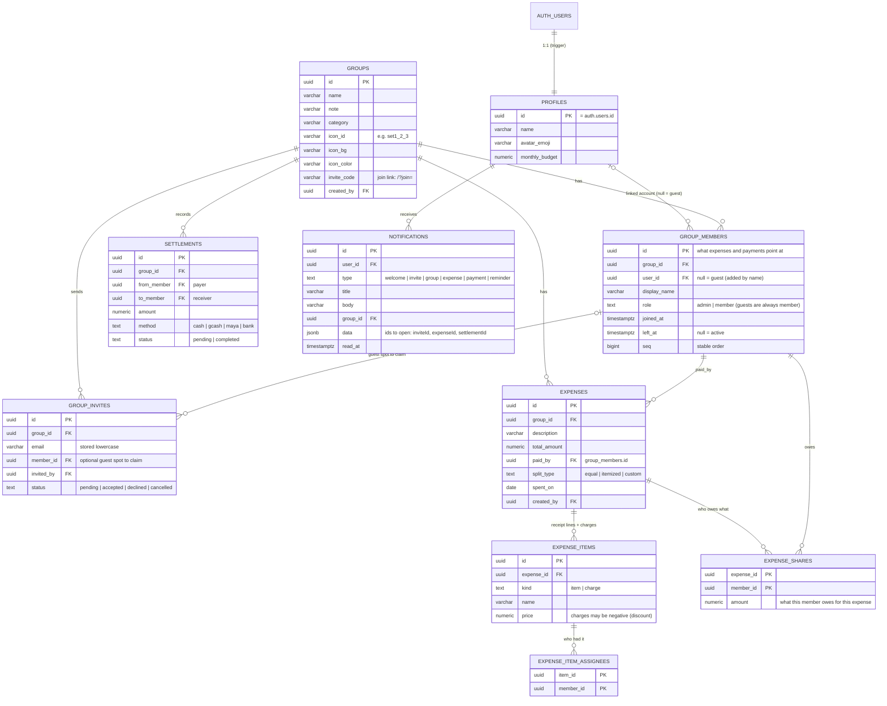

# Gastosaurus — System Architecture

Gastosaurus tracks group expenses and auto-splits them "ambagan"-style, including itemized splits where people pay only for what they ordered. This document describes how the backend is built and the plan for the remaining phases.

**Status:** Phases 1–5 are built and every screen runs on real data: accounts; groups with guest members, email invites and join links; expenses with equal, itemized and custom splitting; live balances; Settle Up; payments with confirmation; and notifications with reminders and live updates. Deployment (Phase 6) is next. For a plain-language walkthrough of the splitting math, see [HOW-THE-MONEY-WORKS.md](HOW-THE-MONEY-WORKS.md).

---

## 1. The big picture



There are three parts:

| Part | What it does | Where |
|---|---|---|
| **React app** | All screens. Uses `supabase-js` *only* for login, sign-up, Google, password reset, and keeping the session fresh. Every other request goes to our API. | `src/` |
| **Supabase Auth** | Stores accounts and passwords, signs access tokens, sends confirmation and reset emails, and handles Google OAuth. We never handle passwords ourselves. | Supabase dashboard → Authentication |
| **Express API** | All app logic: groups, expenses, splitting math, balances, settlements, notifications. It checks the user's token, then reads and writes Postgres with plain SQL (`pg`). | `server/` |
| **Postgres (Supabase)** | One database. `auth.users` is owned by Supabase. Our tables live in `public` and are created by migrations in `supabase/migrations/`. | Supabase dashboard → Database |

**Why this split?** Supabase Auth gives us secure login, Google sign-in and reset emails for free. Writing those well is hard and easy to get wrong. The money logic (who owes whom) stays in a normal Express + SQL backend, where it's easy to test, explain and grade.

---

## 2. Tech stack

| Layer | Choice | Notes |
|---|---|---|
| Frontend | React 19 + Vite | Existing app. Dev server on `:5173`, proxies `/api` → `:4000`. |
| Auth | Supabase Auth via `@supabase/supabase-js` | PKCE flow. The session lives in localStorage ("Keep me logged in") or sessionStorage (not kept). |
| API | Node.js 20+ · Express 5 · ES modules | Express 5 forwards errors from async handlers automatically. |
| Validation | `zod` | Every request body is validated before it reaches the service layer. |
| Token check | `jose` | Verifies Supabase access tokens against the project's public keys (JWKS). |
| Database | Supabase Postgres 17 via `pg` | Parameterized SQL only (`$1, $2…`), and never string-built values. |
| Tests | `node --test` | The API is tested against a local throwaway Postgres and a fake Supabase Auth server. |
| Hosting (suggested) | Vercel (frontend) · Render (API) · Supabase (DB + auth) | All have free tiers. See §9. |

---

## 3. Folder structure

```
gastosaurus/
├── src/                          React app
│   ├── App.jsx                   navigation, auth session, toasts, add-expense draft, refresh signal
│   ├── components/               one file per screen or modal (+ Avatar, GroupIcon, CustomIcons)
│   ├── hooks/
│   │   ├── useAsync.js           load data from the API, reload when inputs change
│   │   └── useNotifications.js   inbox + pending invites, live via Supabase Realtime
│   ├── lib/
│   │   ├── supabase.js           Supabase client + "Keep me logged in" storage + friendly errors
│   │   ├── api.js                every API call (groupsApi, expensesApi, settlementsApi, …)
│   │   └── format.js             ₱ formatting, dates, "5m ago", initials
│   └── data/groupIcons.js        the 54 group icons
├── server/                       Express API
│   ├── src/
│   │   ├── server.js             starts the app (checks DB first)
│   │   ├── app.js                middleware + route mounting
│   │   ├── config/env.js         all environment variables in one place
│   │   ├── db/pool.js            pg Pool, query(), withTransaction()
│   │   ├── lib/                  verifySupabaseToken.js, money.js (centavos),
│   │   │                         splitting.js (the ambagan algorithm), validators.js
│   │   ├── middleware/           requireAuth, validateBody, errorHandler
│   │   ├── utils/HttpError.js
│   │   └── modules/              each: *.routes.js → *.validation.js → *.service.js → *.repository.js
│   │       ├── profile/          /api/me
│   │       ├── groups/           groups, members, membership guard, invite codes
│   │       ├── invites/          invite by email or join link; accept / decline / cancel
│   │       ├── expenses/         add / edit / delete expenses (runs the split)
│   │       ├── balances/         group balances, dashboard summary, settle-up
│   │       ├── settlements/      record / confirm / undo payments
│   │       └── notifications/    inbox, reminders, and notify.js (every message the app sends)
│   └── test/                     splitting (unit), groups + notifications (end-to-end API), profile
├── supabase/migrations/          SQL migrations, applied in filename order
└── docs/
    ├── ARCHITECTURE.md           this file
    ├── HOW-THE-MONEY-WORKS.md    app flow + splitting algorithm in plain language
    └── QA-CHECKLIST.md           what to click through before a release, and files safe to delete
```

### How the React app gets its data

- **Each screen loads what it shows** with `useAsync(() => api.call(), [inputs, refreshKey])`. There is no global store; `App.jsx` only keeps which screen and group are open.
- **After any save, call `onChanged()`** (it's `refresh()` in `App.jsx`). That bumps `refreshKey`, and every visible screen re-fetches, so balances everywhere stay in sync.
- **Notifications are live.** `useNotifications` subscribes to Supabase Realtime for the user's own `notifications` rows. When one arrives (say, a friend added an expense), the bell updates and the app refreshes.
- **Adding an expense is a two-step draft** kept in `App.jsx`. The calculator adds one item at a time, then the item-split screen assigns items to people. Saving sends one item as an `equal` split and several as an `itemized` split; the server does the centavo math.
- **Join links** look like `<app>/?join=<code>`. The code is kept in sessionStorage across sign-up or log-in, then `POST /api/invites/join` adds the user.
### Layers inside each API module

```
routes  →  validation (zod)  →  service (rules, math)  →  repository (SQL only)
```

- **routes**: URL + method, `requireAuth`, `validateBody(schema)`, call the service, send JSON.
- **service**: business rules ("only members can add expenses", "shares must add up to the total"). No `req`/`res` here.
- **repository**: the only place SQL lives. It returns plain rows.

Small modules (like `profile`) can put the service logic in the route file. Split it out once it grows.

### Error format (every endpoint)

```json
{ "error": { "code": "VALIDATION_ERROR", "message": "Please check the highlighted fields.", "fields": { "name": "Enter your name or nickname." } } }
```

Codes in use: `VALIDATION_ERROR` (400), `UNAUTHORIZED` (401), `FORBIDDEN` (403), `NOT_FOUND` (404), `CONFLICT` (409), `INTERNAL_ERROR` (500). Throw `HttpError.badRequest(...)` and similar from anywhere, and the error handler formats the response.

---

## 4. How login works (Phase 1)



- **Who is the user?** The API trusts only the verified token. `req.user.id` comes from the token's `sub` and equals `auth.users.id` and `profiles.id`. Never accept a user id from the request body.
- **Keep me logged in.** Checked: the session goes in localStorage and survives restarts. Unchecked: it goes in sessionStorage and ends when the tab closes. `supabase-js` refreshes the token automatically.
- **Google.** `signInWithOAuth({ provider: 'google' })` sends the user to Google and back. The same trigger creates their profile, using Google's `full_name`.
- **Forgot password.** `resetPasswordForEmail()` sends a link. When the user returns, Supabase fires `PASSWORD_RECOVERY`, and the app opens the "Set a new password" screen.
- **Token formats.** New Supabase keys are asymmetric (ES256) and verified locally with JWKS. Legacy HS256 tokens are checked by calling `GET /auth/v1/user`, as Supabase recommends. `verifySupabaseToken.js` handles both.

### Phase 1 endpoints

| Method | Path | Auth | Body | Returns |
|---|---|---|---|---|
| GET | `/api/health` | – | – | `{ status: "ok" }` |
| GET | `/api/me` | ✔ | – | `{ user }` (creates the profile if it's missing) |
| PATCH | `/api/me` | ✔ | `{ name?, avatarEmoji?, monthlyBudget? }` | `{ user }` |

Sign up, log in, log out, Google and reset are **not** API endpoints. They're `supabase.auth.*` calls in the browser.

---

## 5. Data model

Migrations, in order: `…010000_create_profiles` (accounts), `…020000_create_groups`, `…030000_create_expenses_and_settlements`, `…040000_create_notifications` (also adds a welcome message to the sign-up trigger) and `…050000_add_group_invite_codes`. All five are applied on the Supabase project.



### Members are rows, not just accounts

The UI lets people add barkada **by name** before those friends have accounts. So a group member is its own row (`group_members.id`) with a display name and an **optional** `user_id`:

- **Guest** (`user_id` null): can be split with, can pay, can be paid. Can't log in or be admin.
- **Claiming:** an invite can point at a guest row (`group_invites.member_id`). When the invitee accepts, the guest row gets their `user_id` and keeps its whole history.
- Expenses, shares, item assignees and settlements all reference `group_members.id`. Composite foreign keys `(group_id, member_id)` make it impossible to pay or split with someone from another group.
- Leaving sets `left_at` and keeps the row, so old bills still show the person's name. Rejoining reactivates the same row.

### Money rules

- Money is stored as `numeric(12,2)`, never `float`. `pg` returns `numeric` as a **string**. The API converts it to integer **centavos** (`lib/money.js`) for all math, and validation turns incoming peso amounts into centavos.
- **`expense_shares` is the source of truth.** Every split type saves one share per person. A deferred constraint trigger refuses to commit if an expense's shares don't add up to its `total_amount` exactly.
- **Rounding:** each person's exact share is computed as a fraction, then rounded with the *largest remainder* method. Shares always add up to the total, and nobody is more than ₱0.01 off their exact share. ₱100 ÷ 3 → 33.34 + 33.33 + 33.33.
- **Itemized:** each item is divided among its assignees. Charges and discounts (`kind = 'charge'`) are spread in proportion to each person's items subtotal. Rounding happens once per person, not once per item.
- **Custom:** typed amounts must equal the total. The error says how many pesos it's short or over.

Algorithm details and worked examples: [HOW-THE-MONEY-WORKS.md](HOW-THE-MONEY-WORKS.md) · code: `server/src/lib/splitting.js` · tests: `server/test/splitting.test.js`.

### Balances (no stored balance column)

```
net = Σ expenses they paid − Σ their expense_shares
    + Σ completed settlements they sent − Σ completed settlements they received
```

This is the view `group_balances (group_id, member_id, net, total_paid, total_share)`, created `with (security_invoker = true)` so it obeys RLS. `net > 0` → `owed`, `net < 0` → `owe`, `0` → `settled`.

**Suggested settlements** (`suggestSettlements`): the biggest debtor pays the biggest creditor, repeated until everyone is at zero. That takes at most *n − 1* payments.

**Payment confirmation:** a payment to a member with an account is `pending` until the receiver confirms. A payment the receiver records, or one to a guest, is `completed` immediately. Only completed payments affect balances, but Settle Up suggestions and reminders count pending payments as already sent, so nobody is asked to pay the same debt twice.

### Notifications

`server/src/modules/notifications/notify.js` is the one place that decides who hears about what and how it's worded. Services call it **inside their own transaction**, so a notification exists only if the change it describes was saved. The person who acted is never notified about their own action, and guests (no account) never are.

| Event | Who is notified |
|---|---|
| Sign-up | the new user (welcome, written by the DB trigger) |
| Invite sent | the invitee, if they already have an account (otherwise they see it under *Invites* after signing up) |
| Someone joins | everyone else in the group |
| Expense added, re-split or deleted | the payer and everyone with a share (with their own share in the message) |
| Payment recorded | the other side. If pending, the receiver gets a **Confirm** action |
| Payment confirmed | the payer |
| Removed from group | the removed member |
| Reminder | members who owe, with exactly whom to pay. At most one per person per group every 12 hours |

### Security in the database

- **RLS is on for every table.** Policies are **read-only**: a logged-in user can `select` rows only for groups they're an active member of. There are no insert, update or delete policies, so the public key can't write anything. All writes go through the API.
- The membership check used by policies is `private.is_group_member(group_id)`, a `security definer` function (with `set search_path = ''`) in a schema the REST API doesn't expose. Being `security definer` avoids recursive RLS on `group_members`.
- The Express API connects as the database owner, which bypasses RLS. **So every service checks membership first** (`assertMember` / the `requireGroupMember` middleware). An outsider gets **404**, not 403, so they can't tell whether a group exists.

---

## 6. API

All endpoints require `Authorization: Bearer <token>`. `:groupId` routes require that the caller is an active member. Amounts are sent and returned as peso numbers (e.g. `1850.5`). The frontend wrappers are in `src/lib/api.js` (`groupsApi`, `invitesApi`, `expensesApi`, `settlementsApi`, `meApi`).

| Phase | Method & path | Purpose | Screen |
|---|---|---|---|
| 1 ✅ | `GET/PATCH /api/me` | Profile | Dashboard header |
| 2 ✅ | `GET /api/groups` | My groups with my balance (`balance`, `statusType`), member count, total spending, latest expense | Dashboard, GroupsView |
| 2 ✅ | `POST /api/groups` | Create. `{ name, category?, iconId?, iconBg?, iconColor?, note?, members?: [{ name, email? }] }`. Creator = admin; members become guests; emails get invites | CreateGroupModal |
| 2 ✅ | `GET /api/groups/:groupId` | `{ group, members, pendingInvites }` | GroupMembersView, GroupDetailModal |
| 2 ✅ | `PATCH /api/groups/:groupId` | Rename, note, category, icon, colors (admin) | GroupDetailModal |
| 2 ✅ | `DELETE /api/groups/:groupId` | Delete (admin, only when everyone is settled) | GroupDetailModal |
| 2 ✅ | `POST /api/groups/:groupId/members` | Add a guest `{ name, email? }` | CreateGroupModal, AddExpenseCalculatorView |
| 2 ✅ | `PATCH /api/groups/:groupId/members/:memberId` | Rename a guest / change role (admin) | GroupMembersView |
| 2 ✅ | `DELETE /api/groups/:groupId/members/:memberId` | Remove a member (admin, balance must be ₱0) | GroupMembersView |
| 2 ✅ | `DELETE /api/groups/:groupId/members/me` | Leave (balance must be ₱0) | LeaveGroupModal |
| 2 ✅ | `POST /api/groups/:groupId/invites` | Invite `{ email, memberId? }` (memberId = guest spot to claim) | InviteMemberView |
| 2 ✅ | `GET /api/invites` | Invites waiting for me | NotificationsView |
| 2 ✅ | `POST /api/invites/:id/accept` · `/decline` · `DELETE /api/invites/:id` | Respond to or cancel an invite | NotificationsView, InviteMemberView |
| 3 ✅ | `GET /api/groups/:groupId/expenses?limit&offset` | Expense list with `myShare` | ExpensesDetailView |
| 3 ✅ | `POST /api/groups/:groupId/expenses` | Add an equal / itemized / custom expense (computes shares). Bodies in `expenses.validation.js` | AddExpenseCalculatorView, ItemizedAmbaganView |
| 3 ✅ | `GET/PATCH/DELETE /api/expenses/:id` | Detail (items, charges, shares). PATCH with `splitType` re-splits; without it, edits description/date/note only | ExpensesDetailView |
| 4 ✅ | `GET /api/groups/:groupId/balances` | `{ me, members[net], suggestedSettlements, isSettled }` | SettlementsView, GroupMembersView |
| 4 ✅ | `GET /api/me/summary?month=YYYY-MM` | Net balance, you owe, you are owed, group counts, monthly spending vs budget (month in Asia/Manila) | Dashboard cards, PersonalBalanceModal |
| 4 ✅ | `GET /api/me/settle-up` | Across all groups: `toPay`, `toReceive`, payments awaiting confirmation, recent payments | SettlementsView |
| 4 ✅ | `GET/POST /api/groups/:groupId/settlements` | List / record a payment `{ toMemberId, amount, method, fromMemberId?, note? }` | PaymentView, SettleUpModal |
| 4 ✅ | `PATCH /api/settlements/:id` `{ status: "completed" }` · `DELETE` | Receiver confirms / withdraw or undo | SettlementsView |
| 2 ✅ | `POST /api/invites/join` `{ code }` · `POST /api/groups/:groupId/invite-code` | Join with a share link · reset the link (admin) | InviteMemberView |
| 5 ✅ | `GET /api/notifications?limit&before&unread=true` | `{ notifications, unreadCount }` | Navbar bell, NotificationsView |
| 5 ✅ | `PATCH /api/notifications/:id/read` · `POST /api/notifications/read-all` · `DELETE /api/notifications/:id` | Mark read / clear | NotificationsView |
| 5 ✅ | `POST /api/groups/:groupId/reminders` `{ memberIds? }` | Nudge members who owe → `{ sent, skipped }` | SettlementsView, GroupDetailModal |

Every screen now uses these through `src/lib/api.js`; `mockData.js` is no longer imported anywhere.

---

## 7. Roadmap

| Phase | Scope | Status |
|---|---|---|
| **1. Accounts** | Supabase Auth, `profiles` + trigger + RLS, `/api/me`, login/sign-up/Google/forgot/new-password UI | ✅ |
| **2. Groups** | Groups, guest members, email invites (claim a guest spot), join links, leave/remove rules, admin hand-over | ✅ |
| **3. Expenses** | Equal / itemized (with charges and discounts) / custom splitting in centavos, shares-equal-total trigger | ✅ |
| **4. Balances & settlements** | `group_balances` view, Settle Up suggestions, payments with confirmation, dashboard summary, cross-group settle-up | ✅ |
| **5. Notifications** | Notifications written by the services, reminders with cooldown, live updates with Supabase Realtime | ✅ |
| **Screens on real data** | Every screen uses `src/lib/api.js`; mock data removed from use | ✅ |
| **6. Deploy** | Vercel + Render + Supabase production settings | Next |

## 8. Running it locally

1. **Frontend env:** `cp .env.example .env.local`. The Supabase URL and publishable key are already filled in.
2. **Backend env:** `cd server && cp .env.example .env`, then paste the database connection string (see `server/README.md`).
3. **Database:** all migrations up to `20261003050000_add_group_invite_codes.sql` are already applied on the `gastosaurus` Supabase project. When someone adds a new file to `supabase/migrations/`, run it once in SQL Editor (paste → Run), then check Advisors.
4. Install dependencies in both folders: `npm install` at the repo root and `npm install` in `server/`.
5. Run the API and the frontend in two terminals: `cd server && npm run dev` (API on :4000) and `npm run dev` at the root (app on :5173).

### Supabase dashboard settings (one-time, project owner)

| Where | Setting | Why |
|---|---|---|
| Authentication → URL Configuration | **Site URL** = `http://localhost:5173`. Add `http://localhost:5173/**` to Redirect URLs (later, your Vercel URL too). | Confirmation, reset and Google links come back to the app. |
| Authentication → Providers → Email | For class demos, turn **Confirm email** off, *or* set up custom SMTP (Authentication → Emails). | Supabase's built-in email only delivers to your own team's addresses and is heavily rate-limited, so groupmates won't get confirmation emails without SMTP. |
| Authentication → Providers → Google | Enable it and paste the Client ID and Secret from Google Cloud Console (OAuth client, type "Web"). Authorized redirect URI: `https://oieupqfsmnbcoatoicef.supabase.co/auth/v1/callback`. | Makes "Continue with Google" work. Until then it shows a friendly "not switched on yet" message. |

---

## 9. Deployment (when ready)

- **Frontend → Vercel.** Set `VITE_SUPABASE_URL` and `VITE_SUPABASE_PUBLISHABLE_KEY`. To keep `/api` same-origin, add a `vercel.json` rewrite from `/api/(.*)` to `https://<your-render-app>.onrender.com/api/$1`. Otherwise set `VITE_API_URL` and the server's `CLIENT_ORIGIN`.
- **API → Render** (Web Service, root `server/`, start command `npm start`). Set `NODE_ENV=production`, `DATABASE_URL` (pooler string), `SUPABASE_URL`, `SUPABASE_PUBLISHABLE_KEY` and `CLIENT_ORIGIN`.
- **Supabase.** Add the production URL to Auth → URL Configuration. Run `get advisors` in the dashboard (Advisors) after every migration.

## 10. Conventions

- **Migrations.** `supabase/migrations/YYYYMMDDHHMMSS_short_name.sql`. Never edit one that's already applied; add a new file. Every new table gets `enable row level security` plus policies in the same file.
- **SQL.** Use `$1` parameters, `snake_case` columns in the DB and `camelCase` in JSON. Repositories convert between them.
- **Secrets.** The publishable key can be public. The database password, `.env` files and any `sb_secret_…` key must never be committed. `.gitignore` covers `.env*` and `server/.env`.
- **Branches.** Use one branch per phase (`backend-auth`, `backend-groups`, …) and merge to `main` with a pull request.
