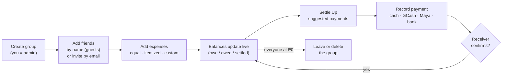

# How Gastosaurus works — the app flow and the ambagan algorithm

This is the plain-language guide to Phase 2: what happens when a barkada uses the app, and the math behind "who owes whom". The code lives in `server/src/lib/splitting.js` (the algorithm) and `server/src/modules/*` (the API). Every example below is checked by a test in `server/test/`.

---

## 1. The life of a group



1. **Create a group.** The creator becomes the admin. Friends can be added **by name** right away ("Bea", "Miguel"). These are *guest members*: they don't need an account yet.
2. **Invite people (optional).** Send Bea an email invite from her guest card. When she signs up and accepts it, she **claims her guest spot**: every bill already split with "Bea" becomes hers, and nothing has to be re-entered. Or share the group's **join link**, and anyone who opens it joins as a new member.
3. **Add expenses.** Whoever paid is the *payer*. The app works out each person's *share* (see §2).
4. **Balances update by themselves.** Nobody types a balance. Each one is recalculated from the bills and payments (see §3).
5. **Settle Up.** The app suggests the fewest payments that bring everyone to ₱0 (see §4).
6. **Record a payment.** If you pay someone with an account, the payment waits until they confirm they received it (they get a **Confirm received** button in their notifications). A payment to a guest, or one the receiver records with **Mark received**, counts immediately.
   - While a payment is waiting for confirmation, Settle Up stops asking you to pay that debt again.
7. **Stay in the loop.** Everyone involved is notified when bills are added or changed and when payments arrive. **Send Reminders** nudges the people who owe you, telling each one exactly whom to pay, at most once every 12 hours.
8. **Leave.** You can leave a group only when your balance is ₱0, so nobody can walk away from a debt. An admin can delete the group once everyone is settled.

---

## 2. Splitting a bill

All math happens in **centavos** (whole numbers: ₱1.00 = 100) so no centavo is ever lost to rounding. The database stores money as `numeric(12,2)`, never as `float`.

### The one rounding rule

Every split type ends with the same step:

1. Work out each person's **exact** share, even if it's a fraction (₱100 ÷ 3 = ₱33.333…).
2. Give everyone the whole centavos of their share (₱33.33 each = ₱99.99).
3. Hand out the centavos left over (₱0.01 here), one each, to the people whose dropped fraction was biggest. On a tie, the people listed first get them.

This is the **largest remainder method**. The shares always add up to the bill exactly, and nobody pays more than ₱0.01 above their exact share.

### Equal ("Split Equally")

> ₱100 among Alex, Bea, Miguel → **₱33.34 + ₱33.33 + ₱33.33**

### Itemized ("Itemized Ambagan"): pay only for what you had

Each item is divided among the people who had it. **Charges** (service charge, delivery, tip) are spread **in proportion** to what each person ordered. A **discount** is a negative charge and is spread the same way.

> Dinner, paid by Miguel:
>
> | Item | Price | Who had it | Each |
> |---|---|---|---|
> | Wagyu | ₱300 | Alex, Bea, Miguel | ₱100 |
> | Sake | ₱120 | Bea, Miguel | ₱60 |
> | Service charge | ₱42 | spread by what you ordered | |
>
> Items: Alex ₱100, Bea ₱160, Miguel ₱160 (subtotal ₱420)
> Charge share = own items × 42 ÷ 420 = 10% → Alex **₱110**, Bea **₱176**, Miguel **₱176** (total ₱462 ✔)

Rounding happens **once per person**, not once per item. If two ₱100 items are each shared by three people, everyone's exact share is ₱66.666…, giving ₱66.67 / ₱66.67 / ₱66.66. Rounding each item separately could charge one person ₱66.68.

### Custom

The user types each person's amount, and the amounts must add up to the total exactly. If they don't, the app says by how much: *"The shares are ₱50.00 short of the total."*

### What gets saved

Whatever the split type, saving an expense writes **one share row per person** (`expense_shares`). Those rows are the source of truth for balances. Saving happens in a single transaction, and the database refuses to commit if the shares don't add up to the total.

---

## 3. Balances: computed, never stored

For each member of a group:

```
net = what they paid for the group
    − their shares of the group's bills
    + payments they sent       (confirmed only)
    − payments they received   (confirmed only)
```

| net | Shown as | `statusType` |
|---|---|---|
| > 0 | "You are owed ₱…" | `owed` |
| < 0 | "You owe ₱…" | `owe` |
| = 0 | "Settled" | `settled` |

All the nets in a group always add up to ₱0, since every peso someone paid is a peso someone else owes. This lives in the SQL view `group_balances`, so **editing or deleting an expense fixes everyone's balance automatically**.

> After the two bills above (₱100 tricycle paid by Alex, ₱462 dinner paid by Miguel):
> Alex 100 − 33.34 − 110 = **−₱43.34** · Bea 0 − 33.33 − 176 = **−₱209.33** · Miguel 462 − 33.33 − 176 = **+₱252.67**  (sum = 0 ✔)

---

## 4. Settle Up: the fewest payments

Instead of everyone paying everyone back bill by bill, the app looks only at the **net** balances and suggests payments using a greedy rule:

1. Take whoever **owes the most** and whoever **is owed the most**.
2. The first pays the second as much as one of them needs.
3. That clears at least one of them. Repeat until everyone is at ₱0.

> Bea −209.33, Alex −43.34, Miguel +252.67
> → **Bea pays Miguel ₱209.33**, **Alex pays Miguel ₱43.34**. Done in 2 payments.

Payments that are already sent but not yet confirmed are counted as done here, so the list never asks for the same money twice.

Each payment clears at least one person, so a group of *n* people needs **at most n − 1 payments**. Chains collapse too: if A owes B and B owes C the same amount, the app just says "A pays C". A test checks this on 200 random groups: every balance ends at exactly ₱0, using no more than n − 1 payments.

---

## 5. Who can do what

| Action | Who |
|---|---|
| See a group, its expenses, balances | Active members only. Outsiders get "not found". |
| Add guests, invite by email or link, add expenses, record payments, send reminders | Any member |
| Edit / delete an expense | Whoever added it, whoever paid, or an admin |
| Confirm a payment | The receiver (or an admin) |
| Undo a confirmed payment | The receiver or an admin |
| Rename group, change icon or note, change roles, remove a member, reset the join link, delete group | Admins |
| Leave / be removed | Only at ₱0 balance |
| Last admin leaves | The longest-standing member with an account becomes admin (guests can't be admins) |

These rules are checked in the API's service layer. Row Level Security in Postgres adds a second lock: through Supabase's public API, a logged-in user can only **read** their own groups' rows and can't write anything.
